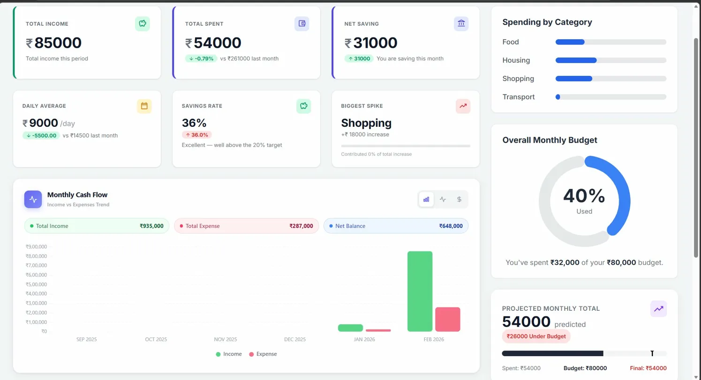
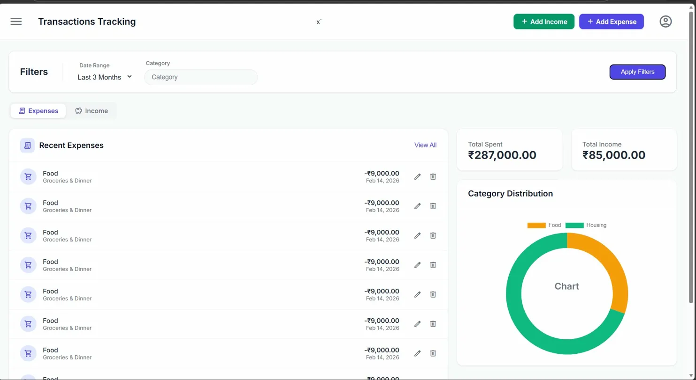
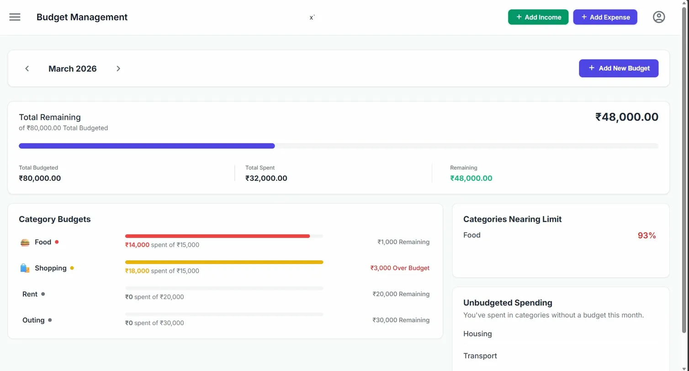

# 💰 MoneyT — Personal Finance Analytics Platform

A full-stack personal finance platform built with **Spring Boot 4.0.1** and **Angular 21**.  
MoneyT goes beyond basic expense tracking — it delivers predictive spending forecasts, month-over-month analytics, and dynamic daily allowances to give users genuine control over their financial health.

---

## 📸 Screenshots

| Dashboard | Transactions | Budget |
|:-:|:-:|:-:|
|  |  |  |

---

## ✨ Features

### 📊 Analytics Dashboard
- **Month-over-Month Comparisons** — Total spent, daily average, and savings rate tracked against the previous month
- **Spending Anomaly Detection** — Identifies the category with the highest MoM spending spike and its contribution to total overspend
- **Predictive Forecasting** — Projects end-of-month spending using daily velocity extrapolation, visualised against the total budget
- **Dynamic Safe Daily Allowance** — Recalculates every day based on remaining budget, remaining days, and actual income
- **Historical Cash Flow Trends** — 6-month income vs expense bar and line charts with net savings momentum

### 💸 Transaction Management
- **Smart Filtering** — Filter by date range (current month, last 3/6 months, last year) and by category or income source
- **Server-side Pagination** — All list endpoints are paginated — the frontend never fetches full datasets
- **Category Breakdown** — Pie chart visualisation for immediate expense auditing
- **Recent Activity** — Quick-glance view of the 5 most recent income and expense entries

### 🎯 Budget Management
- **Category-level Tracking** — Precise spent-vs-budget ratios per category
- **Proactive Alerts** — Flags categories exceeding 80% utilisation before they breach
- **Unbudgeted Spend Detection** — Automatically surfaces transactions in categories with no defined budget

### 🔐 Security
- **JWT Stateless Auth** — Secure login and registration via Spring Security 6
- **Token-based User Isolation** — Every endpoint is protected; users access only their own data

### 🐳 DevOps
- **Fully Dockerised** — Entire stack (frontend + backend + database) runs with a single `docker-compose up`
- **Nginx Reverse Proxy** — Production-ready frontend serving and API routing

---

## 🛠 Tech Stack

### Backend
| Technology | Version | Purpose |
|---|---|---|
| Java | 21 | Core language |
| Spring Boot | 4.0.1 | REST API framework |
| Spring Security | 6 | JWT authentication & authorisation |
| Hibernate / JPA | via Spring Boot | ORM & database access |
| PostgreSQL | 15 | Primary relational database |
| Maven | 3.9+ | Build & dependency management |

### Frontend
| Technology | Version | Purpose |
|---|---|---|
| Angular | 21 | Single-page application framework |
| TypeScript | latest | Type-safe component development |
| RxJS | latest | Reactive data streams & state management |
| Chart.js | latest | Dashboard data visualisation |
| Tailwind CSS | latest | Utility-first responsive styling |

### DevOps
| Technology | Purpose |
|---|---|
| Docker | Containerisation |
| Docker Compose | Multi-service orchestration |
| Nginx | Frontend serving & reverse proxy |

---

## 🧠 Key Technical Decisions

**BigDecimal Arithmetic**
All monetary calculations use `BigDecimal` with `RoundingMode.HALF_UP`. Floating-point types (`double`, `float`) are never used for financial math — a deliberate choice to prevent precision errors in currency calculations.

**Daily Velocity Projection**
The predictive engine calculates a daily burn rate (`totalSpent ÷ daysPassed`) and extrapolates forward (`burnRate × remainingDays + totalSpent`). The logic branches explicitly on past, current, and future month contexts with edge case handling for month-start and zero-spend scenarios.

**Safe Daily Allowance**
Remaining budget is capped at actual income (`min(totalBudget, totalIncome)`) before dividing by remaining days. Returns zero for past months or when the budget is already exceeded — preventing misleading positive values.

**Spending Anomaly Detection**
The spike algorithm compares per-category spend MoM, identifies the category with the largest absolute increase, then expresses it as a percentage of total MoM overspend. This surfaces *what changed*, not just *what costs the most*.

**N+1 Query Elimination**
Custom JPQL aggregation queries replace lazy-loaded relationship chains across the dashboard. A single aggregated query replaces what would otherwise be N+1 round-trips per category.

**Stateless JWT Authentication**
No server-side session storage. Each request carries a self-contained token validated by a custom Spring Security filter chain, keeping the backend fully stateless and horizontally scalable.

**Reactive Frontend**
RxJS `BehaviorSubjects` drive all data flows. Components subscribe once in `ngOnInit` and use `takeUntil(destroy$)` to automatically unsubscribe on navigation, preventing memory leaks.

**Server-side Pagination**
All list endpoints accept `page` and `size` parameters. The frontend never requests full datasets, keeping response times consistent regardless of data volume.

**Global Exception Handling (RFC 7807)**
A `@RestControllerAdvice` handler maps all application exceptions to `ProblemDetail` responses — the RFC 7807 standard built into Spring Boot 3+. Clients receive consistent, structured error payloads across all endpoints.

---

## 🔑 API Overview

| Method | Endpoint | Description | Auth |
|---|---|---|---|
| POST | `/api/auth/register` | Register new user | ❌ |
| POST | `/api/auth/login` | Login, returns JWT | ❌ |
| GET | `/api/expenses` | Paginated expenses with filters | ✅ |
| POST | `/api/expenses` | Create expense | ✅ |
| PUT | `/api/expenses/{id}` | Update expense | ✅ |
| DELETE | `/api/expenses/{id}` | Delete expense | ✅ |
| GET | `/api/income` | Paginated income with filters | ✅ |
| POST | `/api/income` | Create income entry | ✅ |
| GET | `/api/budget` | Get budgets by month | ✅ |
| POST | `/api/budget` | Create or update budget | ✅ |
| GET | `/api/dashboard-overview` | Full analytics dashboard payload | ✅ |

> All protected endpoints require an `Authorization: Bearer <token>` header.

---

## 🚀 Run Locally

### Prerequisites

| Tool | Version |
|---|---|
| Java | 21+ |
| Maven | 3.9+ |
| Node.js | 18+ |
| PostgreSQL | 15+ |
| Docker *(optional)* | latest |

---

### Option A — Docker *(Recommended)*

Runs frontend + backend + database in one command. No manual setup needed.

```bash
# Clone the repo
git clone https://github.com/YOUR-USERNAME/moneyt.git
cd moneyt

# Start everything
docker-compose up --build
```

| Service | URL |
|---|---|
| Frontend | http://localhost:80 |
| Backend API | http://localhost:8080 |
| PostgreSQL | localhost:5432 |

```bash
# Stop all services
docker-compose down
```

---

### Option B — Manual Setup

**1. Clone the repo**
```bash
git clone https://github.com/Kanad-8/moneyt.git
cd moneyt
```

**2. Set up the database**
```sql
CREATE DATABASE moneyt;
```

**3. Configure the backend**
```bash
cd backend
cp src/main/resources/application.example.properties \
   src/main/resources/application.properties
```

Fill in your values:
```properties
spring.datasource.url=jdbc:postgresql://localhost:5432/moneyt
spring.datasource.username=YOUR_DB_USER
spring.datasource.password=YOUR_DB_PASSWORD
jwt.secret=YOUR_JWT_SECRET_KEY
jwt.expiration=86400000
```

**4. Run the backend**
```bash
mvn spring-boot:run
```
API available at `http://localhost:8080`

**5. Run the frontend**
```bash
cd ../frontend
npm install
ng serve
```
App available at `http://localhost:4200`

---

## 📄 License

MIT License — free to use and modify.

---

<div align="center">
  Built with Java 21 · Spring Boot 4.0.1 · Angular 21 · PostgreSQL 15 · Docker
</div>
